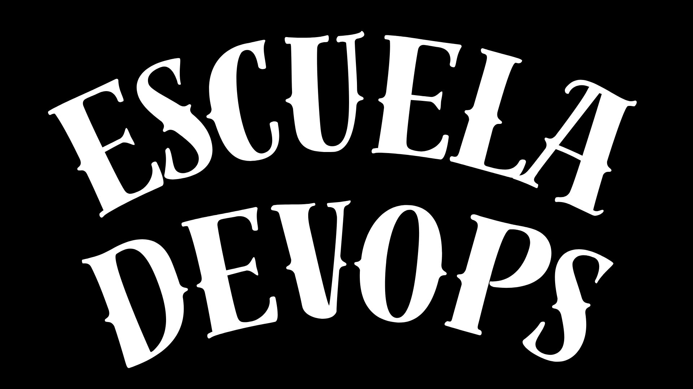
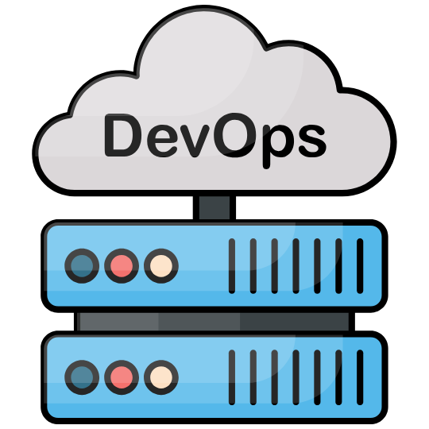
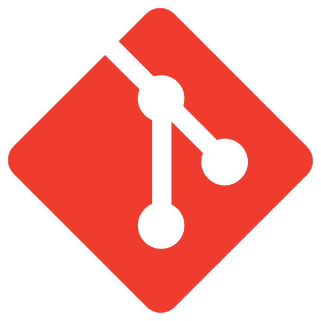

# El camino de DevOps

Este repo contiene todo el material para aprender acerca de diferentes temas relacionados a DevOps

¡Aprende y disfruta!

<!-- markdownlint-disable -->

  

Aquí tienes todo el contenido que puedes explorar

    <table>
        <tr>
            <td align="center"><a href="docs/devops/README.md"> <b>DevOps</b></a></td>
            <td align="center"><a href="docs/azure/README.md"> <b>Azure</b></a></td>
            <td align="center"><a href="docs/git/README.md"> <b>Git</b></a></td>
            <td align="center"><a href="docs/ingenieria/README.md"> <b>Software</b></a></td>
            <td align="center"><a href="docs/terraform/README.md"> <b>Terraform</b></a></td>
            <td align="center"><a href="docs/cicd/README.md"> <b>CI/CD</b></a></td>
        </tr>
    </table>

