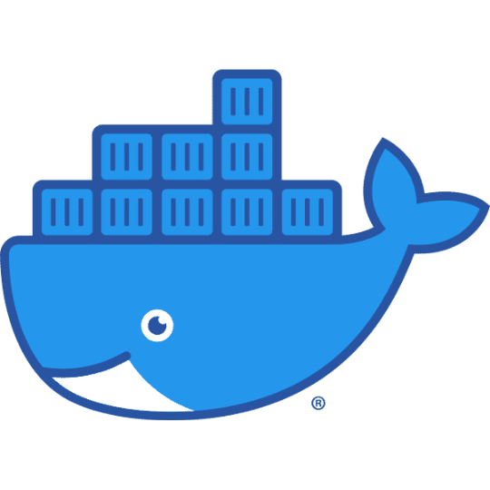

# Lista de estudio de Docker

<!-- markdownlint-disable -->

  

En esta lista encontrás los videos para poder aprender acerca de Docker.

|Nivel|Tema|Descripción|
|-----|----|-----------|
|Principiante|[Introducción a contenedores de Docker](https://youtu.be/P82FF4-Ee2k)|Aprende lo más básico de cómo utilizar Docker.|
|Principiante|[¡Presume tus sitios web y practica con Docker al mismo tiempo!](https://youtu.be/PAYpsQWVwNA)|Como desplegar sitios web en modo local y remoto usando Docker.|
|Intermedio|[Publicando mi contenedor en Docker Hub](https://youtu.be/JIqU3sjziXo)|Aprende a publicar tus imágenes de Docker en un registro de contenedores.|
|Intermedio|[Todos tus contenedores listos en una sola línea ¡La magia de Docker Compose!](https://youtu.be/yppBBXwpTy8)|Conoce las bases para usar Docker Compose y orquestar tus primeros servicios.|

