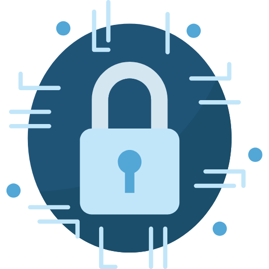

# Lista de estudio de Seguridad

<!-- markdownlint-disable -->

  

En esta lista encontrás los videos para poder aprender acerca de Microservicios.

|Nivel|Tema|Descripción|
|-----|----|-----------|
|Principiante|[¿Quieres ser un hacker? ¡Estas herramientas te interesarán!](https://youtu.be/_iMmLJ5btv8)|Conoce algunas de las herramientas más básicas para comenzar a aprende acerca de pentesting.|

